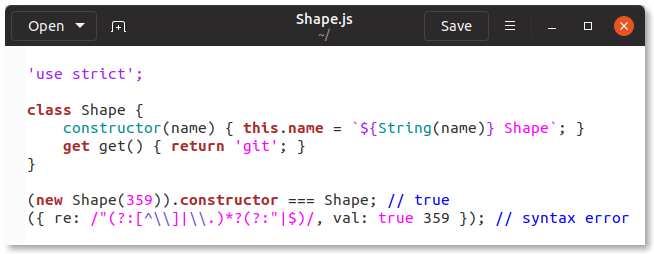

# GtkSourceView syntax highlighting for JavaScript / TypeScript / JSX

## Introduction

[GtkSourceView] is the text editing component used by [gedit] and [GNOME
Builder].

[GtkSourceView]: https://wiki.gnome.org/Projects/GtkSourceView/
[gedit]: https://wiki.gnome.org/Apps/Gedit
[GNOME Builder]: https://wiki.gnome.org/Apps/Builder

### Doesn't gedit / GNOME Builder already have syntax highlighting for JavaScript?

Yes, they do. And like highlighting for most languages, it is based on
keyword / regular expression matching across the whole file. This isn't
necessarily a problem; it has done the job well enough up to now.

I wanted to add TypeScript and JSX highlighting, reusing JavaScript
highlighting as a base. Early on it became obvious this simple matching
wasn't going to be enough:

```tsx
var elementNotType = true ?
        <tag                        // JSX element
            attr="value"></tag>
        : boolean                   // ternary operator else clause
    , typeNotElement
        : boolean                   // type annotation
        = num
        <tag                        // less than operator
            && attr > value;
```

I couldn't just search for `: type` or `<tag` and highlight them
differently; these are valid parts of JavaScript syntax.

### Can this be done with better regular expressions?

Maybe, but something the syntax highlighting [language definition
reference] doesn't mention is that regular expressions only have access
to one line of text at a time. This makes recognizing the different
cases in the example above almost impossible using regular expressions
alone.

GtkSourceView also supports the use of [contexts] in language
definitions, a way of partitioning a source file into sections that can
be highlighted differently. By following the grammar of a particular
language, one can use container contexts to "parse" a source file.

[language definition reference]: https://developer.gnome.org/gtksourceview/stable/lang-reference.html
[contexts]: https://developer.gnome.org/gtksourceview/stable/lang-reference.html#id-1.4.3.14

### What... what did you do?

I rewrote JavaScript syntax highlighting so that it "understands" the
different expressions and statements of the language, following the
grammar defined in [ECMA-262]. (More specifically, it supports ES2019
and several [finished ES2020 proposals], plus a [few][ECMA-402]
[other][WebAssembly JavaScript Interface] [related][WebAssembly Web API]
specifications.)




Then I added language definitions for [TypeScript] (up to 3.5) and [JSX]
(and TypeScript JSX), by augmenting JavaScript highlighting in the
correct places with highlighting specific for these languages.


I also fixed up the definitions of a few other languages that are
affected by the JavaScript rewrite, specifically HTML, JSON, and
Objective-J. (I did a semi-rewrite for [Objective-J], as the original
language definition assumed the language was basically Objective-C.)

[ECMA-262]: https://tc39.es/ecma262/
[finished ES2020 proposals]: https://github.com/tc39/proposals/blob/034ebab571dd118e2b9d3131b9d588585bb2bddf/finished-proposals.md
[ECMA-402]: https://tc39.es/ecma402/
[WebAssembly JavaScript Interface]: https://webassembly.github.io/spec/js-api/
[WebAssembly Web API]: https://webassembly.github.io/spec/web-api/
[TypeScript]: https://github.com/microsoft/TypeScript/blob/f30e8a284ac479a96ac660c94084ce5170543cc4/doc/spec.md
[JSX]: https://github.com/facebook/jsx/blob/3c9c8c9b7bbc5351f0bd578ce54b924dfc148a48/README.md
[Objective-J]: https://www.cappuccino.dev/learn/objective-j.html

### Why don't you submit this to GtkSourceView?

I plan to, but I'd like to have more people test these definitions
first.

These new language definitions are... complex, and I'm sure there are
corner cases I haven't thought of yet. I hope to fix any bugs found by
others before opening a merge request with GtkSourceView.

## Installation

Copy the files in `language-specs` into
`~/.local/share/gtksourceview-4/language-specs`, and the files in
`styles` into `~/.local/share/gtksourceview-4/styles`.

If you are using GtkSourceView 2.0 or 3.0, replace `gtksourceview-4` in
the above paths with `gtksourceview-2.0` or `gtksourceview-3.0`,
respectively.

## How you can help

* If you have found code that is incorrectly highlighted, please [open
  an issue] with a code sample and screenshot if possible.

* If you have used these language definitions for a while and haven't
  encountered any highlighting errors, please add a :+1: reaction to
  [this issue][works for me], just so I have a sense of how "ready"
  these definitions are to be submitted.

[open an issue]: https://github.com/jefferyto/gtksourceview-js-lang/issues
[works for me]: https://github.com/jefferyto/gtksourceview-js-lang/issues/1

## License

GNU Lesser General Public License 2.1 or later

Since I hope to have these merged into GtkSourceView soon, I have left
the project name inside the files unchanged.
